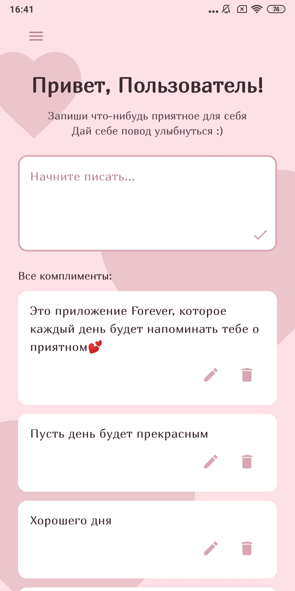
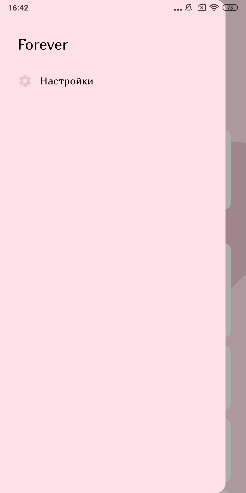

# 🌸 Forever

**Источник поддержки и тепла в любой день**

>⚠️ **Статус проекта: в разработке.**

Это приложение — личный дневник для комплиментов, тёплых слов и приятных воспоминаний. Оно создано, чтобы помочь тебе замечать хорошее, собирать в копилку приятные моменты, искренние комплименты и личные победы, а затем возвращаться к ним, когда нужна поддержка.  
Вдохновлено книгой «К себе нежно» и идеей сохранять всё самое доброе и тёплое, что есть в жизни.

Каждый день уведомление или виджет будет показывать случайную запись — чтобы ты всегда помнил, как много в тебе света.

## 💖 Как это работает

- **Записывай всё**, что заставляет тебя улыбнуться или почувствовать себя ценным
- **Получай** ежедневное напоминание со случайной записью из твоей коллекции
- **Возвращайся** к своим записям, когда нужна поддержка или просто захочется тепла

## 🤍 Основные возможности

- **Добавление и хранение записей** — сохраняй комплименты, приятные моменты и маленькие победы
- **Уведомление со случайной записью** — несколько раз в день приложение присылает запись из твоей коллекции
- **Виджет** — случайная тёплая запись всегда на виду, даже без открытия приложения
- **Полная приватность:** Все записи хранятся локально на устройстве. Твое личное пространство принадлежит только тебе.

## 📸 Скриншоты

|                    Главный экран                    |                    Настройки                     |                        Запись                        |
|:---------------------------------------------------:|:------------------------------------------------:|:----------------------------------------------------:|
|  |  |  |

## 💌 Вклад в проект
Если у тебя есть идеи, как сделать приложение лучше и удобнее, или ты нашел баг — буду рада обсудить это в Issues или Pull Requests!
 
